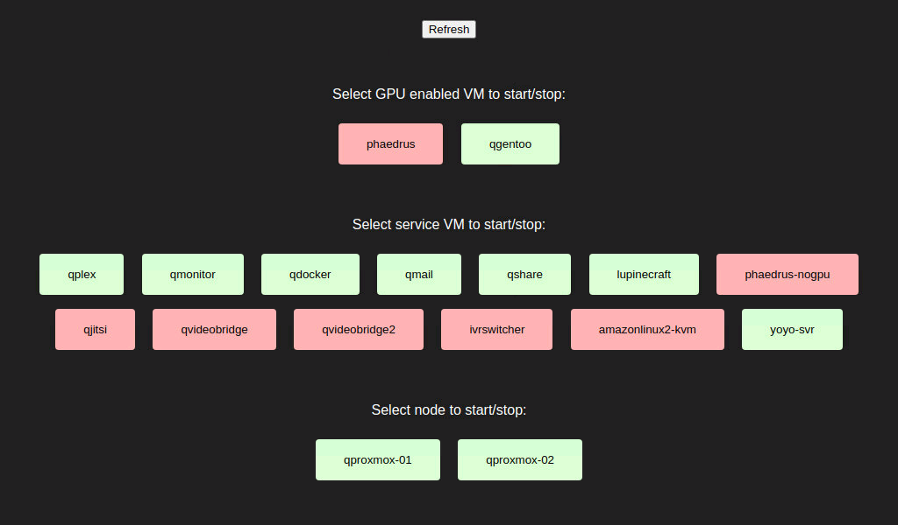

# vmupdown
A simple cweb gui Proxmox VMs & nodes. Specifically for the use case of using a headless proxmox server as a workstation with multiple VMs sharing a single GPU and switching between them as required.



It uses a Flask and Proxmoxer (https://github.com/proxmoxer/proxmoxer) to monitor status and control powering on/off VMs or nodes. It also includes basic detection of conflicts in VFIO pcie devices shared between VMs.

The default credentials are admin:admin. The password can be changed once logged in.

NB - Various assumptions on deployment platform are made in the below instructions, the below relates to Ubuntu.

# Configuration:
- Create a proxmox pam user "vmupdown"
- Create a 'Role' in proxmox called 'vmupdown' and give it the following privileges:
<br />Sys.PowerMgmt, VM.Audit, VM.PowerMgmt
- Create 'Permissions' for both /nodes and /vms for the user and role above.
- Create an API Token for the vmupdown user. Disable 'Privilege Separation'. Note it down.
- Fill out the variables in config.py with values appropriate to your setup, for example:
```
token = "31dc4f09-871e-44eb-9392-4e38b63aab2b"
nodes = {
        "qproxmox-01": {"ip": "192.168.20.2", "mac": "d6:09:6b:f3:72:ec", "status": ""},
        "qproxmox-02": {"ip": "192.168.20.3", "mac": "d6:09:6b:f3:72:ec", "status": ""}
        }
sharedgpu = "0000:0f:00"
```
# Docker Deployment
Example docker compose file:
```
version: '3.3'
services:
    vmupdown:
        container_name: vmupdown
        ports:
            - '8080:80'
        volumes:
            - '$HOME/docker-containers/vmupdown/config.py:/var/www/html/vmupdown/config/config.py'
            - 'db:/var/www/html/vmupdown/db'
        restart: unless-stopped
        image: lupinelab/vmupdown
        build:
          context: ./

volumes:
  db:
    name: vmupdown_db
```
# Manual Deployment
## Requirements:
APT:
```
apt install apache2 libapache2-mod-wsgi-py3 wakeonlan python3-pip
```
PIP:
```
pip install flask proxmoxer requests
```

## Example Installation:
- Configure apache2 to listen on port 8080 in /etc/apache2/ports.conf:
```
...
Listen 8080
...
```

- Copy vmupdown folder into /var/www/html and adjust permissions:
```
cp -R vmupdown /var/www/html/
chown -R www-data:www-data /var/www/html/vmupdown
chmod +x /var/www/html/vmupdown/vmupdown.*
```

- Copy vmupdown.conf to /etc/apache2/sites-available and then enable site:
```
a2ensite vmupdown
```

- Reload apache:
```
systemctl reload apache2
```

- You should now be able to load the site on http://serveripaddress:8080